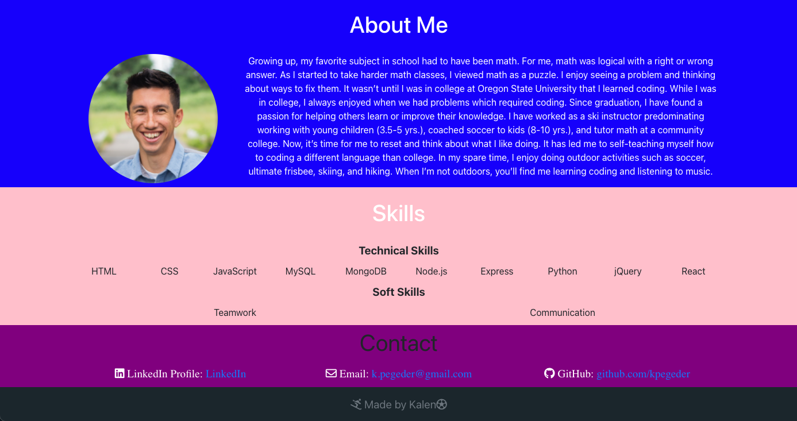
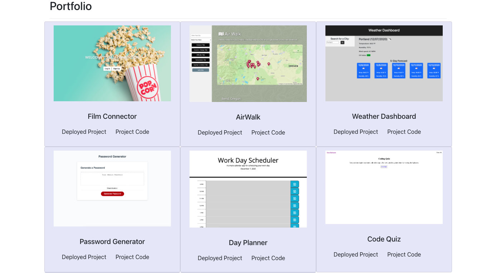

# React Profile

---

## _Links_

[GitHub Repository](https://github.com/kpegeder/react-profile)

[Live Site](https://react-profile1.herokuapp.com/)

---

## Description

Portfolio site to showcase my work as a developer as well as serve as a platform for employers, clients, and colleagues to contact me.

### Table of Contents

- [Technologies](#technologies)
- [Usage](#usage)
- [License](#license)
- [Questions](#questions)

### Technologies

1. React
2. Node

### Usage

### Contributing

[Kalen Pegeder](https://github.com/kpegeder)

### License

Licensed under the MIT license.

### Questions

If you have any additional questions about the applictaion, you can contact through [email](mailto:k.pegeder@gmail.com).
You can see more of my work on [GitHub](https://github.com/kpegeder).
